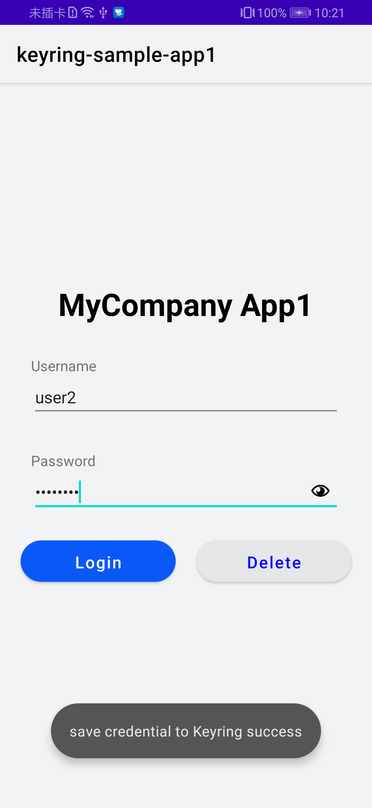

## Keyring SampleApp1 Sample

English | [中文](README_ZH.md)

## Contents

 * [Introduction](#introduction)
 * [Getting Started](#getting-started)
 * [Installation](#installation)
 * [Configuration](#configuration)
 * [Supported Environments](#supported-environments)
 * [Sample Code](#sample-code)
 * [License](#license)

## Introduction
Keyring-SampleApp1 provides sample code for reference. 
1). Call APIs of the Keyring SDK to store credentials and share the stored credentials to Keyring-SampleApp2. 
2). Call APIs of the Keyring SDK to delete the stored credentials.

## Getting Started
Keyring-SampleApp1 is built using Gradle.

Download the demo code by cloning the code repository or downloading the snapshot.

Click **Open an existing Android Studio project** in Android Studio and select the directory of **Keyring-Java-SampleApp1** or **Keyring-Kotlin-SampleApp1** based on your development language.

You need to create an app in AppGallery Connect, obtain the **agconnect-services.json** file, and add it to your project. You also need to generate a signing certificate fingerprint, add the certificate file to your project, and add the signature configuration to the **build.gradle** file. For details, please refer to [Configuring App Information in AppGallery Connect](https://developer.huawei.com/consumer/cn/doc/development/HMSCore-Guides/config-agc-0000001050262772).

Replace **com.huawei.hms.keyring.sample.app1** with your app ID in the module-level **build.gradle** file.

You need to configure the app with which the credentials are shared in the sample code. Therefore, you need to create a second app in AppGallery Connect. Then, replace **XX:XX:XX:XX:XX:XX** in **MainActivity** with the signing certificate fingerprint of the second app. In this way, the sample code will share the stored credentials with the second app. Then, you can use related configurations of the second app to construct sample code of Keyring-SampleApp2.

## Installation
Before using sample code of Keyring-SampleApp1, install Android Studio for developing apps using the Java language. 
Decompress the ZIP package of Keyring-SampleApp1.

## Supported Environments
Java 1.7 or later is recommended.

## Configuration
No additional configuration is required.

## Sample Code
The sample code contains an activity for simulating user sign-in. You can enter a user name and password in the sample app.

After you click the button for sign-in, the sample app will check whether the user name and password are entered. If so, the sample app will use the Keyring SDK to store the user name and password as credentials, and share the credentials with another sample app.

If you click the deletion button, the sample app will check whether the user name is entered. If so, the sample app will use the Keyring SDK to delete stored credentials with the same user name as the entered one.

## Result

##  License
This sample is licensed under the [Apache License 2.0](http://www.apache.org/licenses/LICENSE-2.0).
