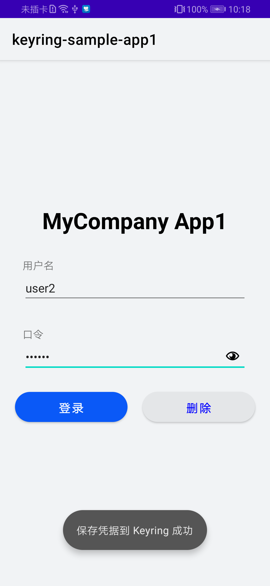

## Keyring SampleApp1 Sample

中文 | [English](README.md)

## 目录

 * [简介](#简介)
 * [开始](#开始)
 * [安装](#安装)
 * [配置](#配置)
 * [支持环境](#支持环境)
 * [样例代码](#样例代码)
 * [许可证](#许可证)

## 简介
Keyring SampleApp1 提供了示例代码供参考：
1). 调用Keyring SDK接口保存凭据，同时将凭据共享给SampleApp2。
2). 调用Keyring SDK接口删除之前保存的凭据。

## 开始
这个示例使用gradle编译。

首先通过克隆此代码库或下载快照来下载演示代码。

在 Android Studio中，使用"Open an existing Android Studio project"，然后根据您使用的语言，选择"Keyring-Java-SampleApp1"或"Keyring-Kotlin-SampleApp1"的目录。

您需要在AppGallery Connect中创建一个应用，并获取agconnect-services.json文件并添加到项目中。您还需要生成签名证书指纹并将证书文件添加到项目中，并将配置添加到 build.gradle。请参阅[AppGallery Connect配置](https://developer.huawei.com/consumer/cn/doc/development/HMSCore-Guides/config-agc-0000001050262772)指南，在 AppGallery Connect中配置应用。

在模块级build.gradle中，使用您自己的applicationId替换掉 "com.huawei.hms.keyring.sample.app1"。

由于在示例代码中需要设置将凭据共享给哪个App，所以您需要在AppGallery Connect中创建"第二个应用"。您需要使用"第二个应用"的证书指纹替换掉MainActivity中的"XX:XX:XX:XX:XX:XX"。这样就将代码调整为，保存凭据时，将凭据共享给"第二个应用"。之后，您可以将"第二个应用"的相关配置，用于构建示例代码Keyring SampleApp2。

## 安装
在使用Keyring SampleApp1代码前，请检查你的java开发环境Android Studio是否安装。
解压Keyring SampleApp1代码zip包。

## 支持环境
推荐使用Java 1.7及以上版本。

## 配置
无需更多配置。

## 样例代码
样例代码构造了一个模拟用户登录的Activity。在界面中，可以输入用户名和口令。

点击"登录"按钮后，会检查是否输入了用户名和口令。然后，会使用Keyring SDK提供的功能，将用户名和口令作为凭据保存，同时设置为将该凭据共享给第二个应用。

点击"删除"按钮后，会检查是否输入了用户名。然后，会使用Keyring SDK提供的功能，从Keyring的数据中删除该应用之前保存的与当前用户名相同名的凭据。

## 结果

## 许可证
此示例代码已获得[Apache 2.0 license](http://www.apache.org/licenses/LICENSE-2.0)。
