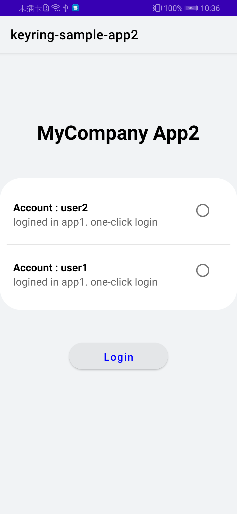
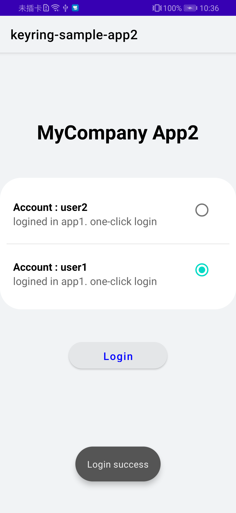

## Keyring SampleApp2 Sample

English | [中文](README_ZH.md)

## Contents

 * [Introduction](#introduction)
 * [Getting Started](#getting-started)
 * [Installation](#installation)
 * [Configuration](#configuration)
 * [Supported Environments](#supported-environments)
 * [Sample Code](#sample-code)
 * [License](#license)

## Introduction
Keyring-SampleApp2 provides sample code for reference. 
1). Call APIs of the Keyring SDK to check credentials stored by the app and credentials shared by other apps. The check result contains credential information, such as the display name and credential type. However, the check result does not contain the credential content. 
2). Call APIs of the Keyring SDK to obtain the queried credential content. If the stored credentials require user authentication, the app will request user authentication when obtaining the credential content. The user can complete authentication using their lock screen password or fingerprint.

## Getting Started
Please refer to the README file for Keyring-SampleApp1. 

Keyring-SampleApp1 is the first sample app. It stores credentials and shares them with the second sample app. Keyring-SampleApp2 is the second sample app.

When building the second sample app, you need to use the app ID and signing certificate fingerprint of the first sample app.

The sample code is built using Gradle.

Download the demo code by cloning the code repository or downloading the snapshot.

Click **Open an existing Android Studio project** in Android Studio and select the directory of **Keyring-Java-SampleApp2** or **Keyring-Kotlin-SampleApp2** based on your development language.

Replace **com.huawei.hms.keyring.sample.app2** with the app ID of your second app in the module-level **build.gradle** file.

When using the sample code to obtain available credentials, you need to specify a list of trusted apps. The list of returned available credentials will include credentials stored by your second app and other credentials shared by the specified trusted apps.

In the sample code, the specified trusted app is the first sample app, that is, Keyring-SampleApp1. 

Replace **XX:XX:XX:XX:XX:XX** in **MainActivity** with the signing certificate fingerprint of the first sample app. In this way, the sample code specifies the first sample app as a trusted app when obtaining credentials.

## Installation
Before using sample code of Keyring-SampleApp2, install Android Studio for developing apps using the Java language. 
Decompress the ZIP package of Keyring-SampleApp2.

## Configuration
No additional configuration is required.

## Supported Environments
Java 1.7 or later is recommended.

## Sample Code
The sample code constructs an activity that requires user sign-in credentials. The sample app can list all available credentials.
You can select a credential and tap the button for sign-in to stimulate password-free sign-in. The sample code will not use the obtained credential content. In actual service scenarios, you can directly use the obtained credential content for sign-in.

## Result

## License
This sample is licensed under the [Apache License 2.0](http://www.apache.org/licenses/LICENSE-2.0).