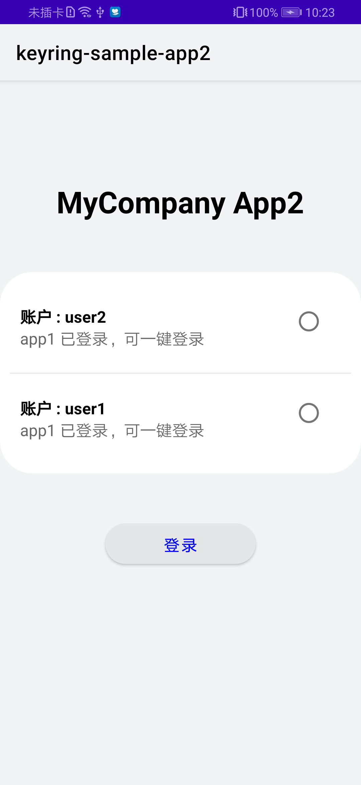
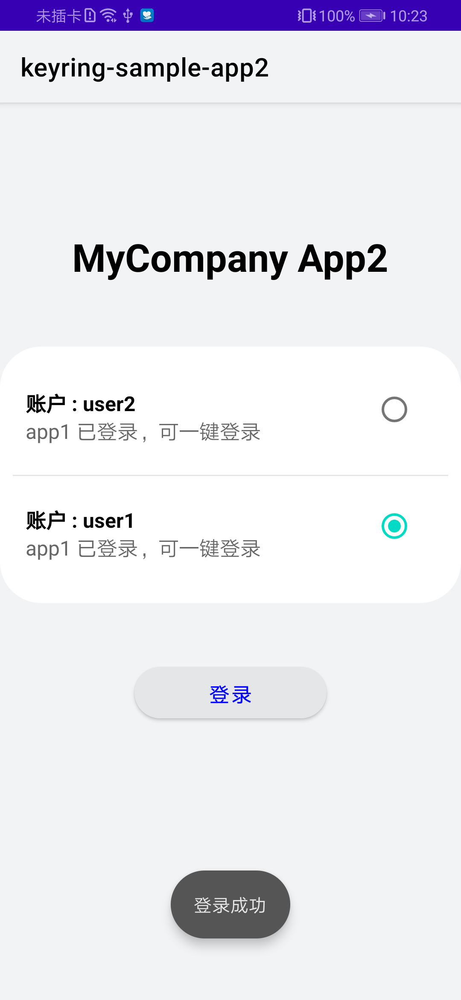

## Keyring SampleApp2 Sample

中文 | [English](README.md)

## 目录

 * [简介](#简介)
 * [开始](#开始)
 * [安装](#安装)
 * [配置](#配置)
 * [支持环境](#支持环境)
 * [样例代码](#样例代码)
 * [许可证](#许可证)

## 简介
Keyring SampleApp2 提供了示例代码供参考：
1). 调用Keyring SDK接口查询自己保存的凭据信息，以及别的应用共享给自己的凭据信息。查询的结果中包含凭据信息，如：显示名称、凭据类型等，但不包含凭据内容。
2). 调用Keyring SDK接口获取查询到凭据的内容。如果凭据在保存时配置为需要用户认证，在获取凭据内容时，将会要求用户认证。用户认证形式为锁屏密码或指纹。

## 开始
请先参阅Keyring-SampleApp1示例中的说明文档。
Keyring-SampleApp1示例应用，是"第一个应用"，会保存凭据，同时将凭据共享给"第二个应用"。这个示例应用，是"第二个应用"。
在构建本示例应用时，需要"第一个应用"的applicationId和证书指纹。

这个示例使用gradle编译。

首先通过克隆此代码库或下载快照来下载演示代码。

在 Android Studio中，使用"Open an existing Android Studio project"，然后根据您使用的语言，选择"Keyring-Java-SampleApp2"或"Keyring-Kotlin-SampleApp2"的目录。

在模块级build.gradle中，使用您自己的"第二个应用"的applicationId替换掉 "com.huawei.hms.keyring.sample.app2"。

在示例代码中列取可用凭据时，需要指定可信应用列表。返回的可用凭据列表中，除了自己保存的凭据外，还有指定的可信应用共享给自己的凭据。
这个示例代码中，可信应用为"第一个应用"，即Keyring-SampleApp1。
您需要使用"第一个应用"的证书指纹替换掉MainActivity中的"XX:XX:XX:XX:XX:XX"。这样就将代码调整为，列取凭据时，指定的可信应用为"第一个应用"。

## 安装
在使用Keyring SampleApp2代码前，请检查你的java开发环境Android Studio是否安装。
解压Keyring SampleApp2代码zip包。

## 支持环境
推荐使用Java 1.7及以上版本。

## 配置
无需更多配置。

## 样例代码
样例代码构造了一个需要用户登录凭据的Activity。在界面中，可以列出当前所有可用凭据。

用户可以选择一个凭据，点击"登录"按钮，模拟免密登录。在示例代码中，不会使用获取到的凭据内容。在真实的业务场景中，可以直接使用获取到的凭据内容进行登录操作。

## 结果

## 许可证
此示例代码已获得[Apache 2.0 license](http://www.apache.org/licenses/LICENSE-2.0)。
